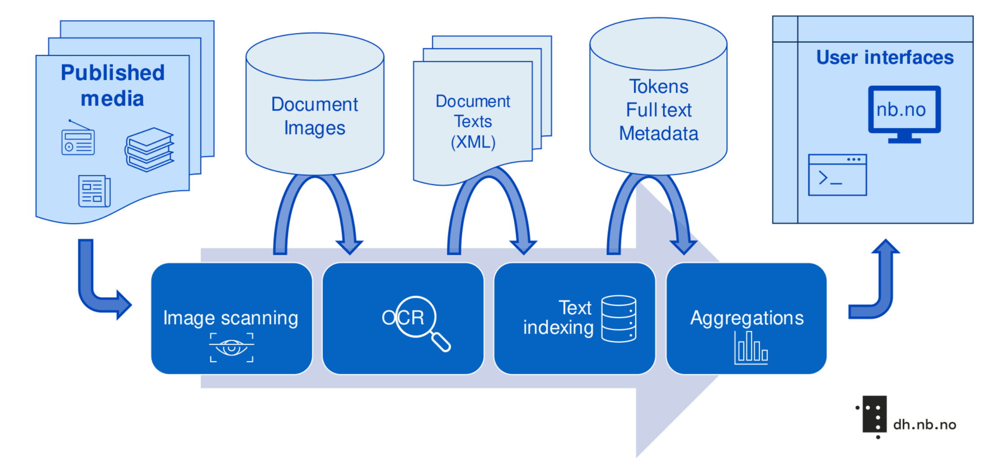
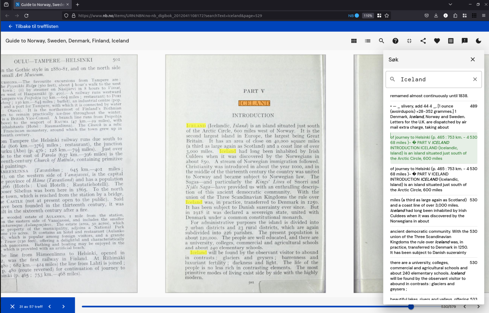
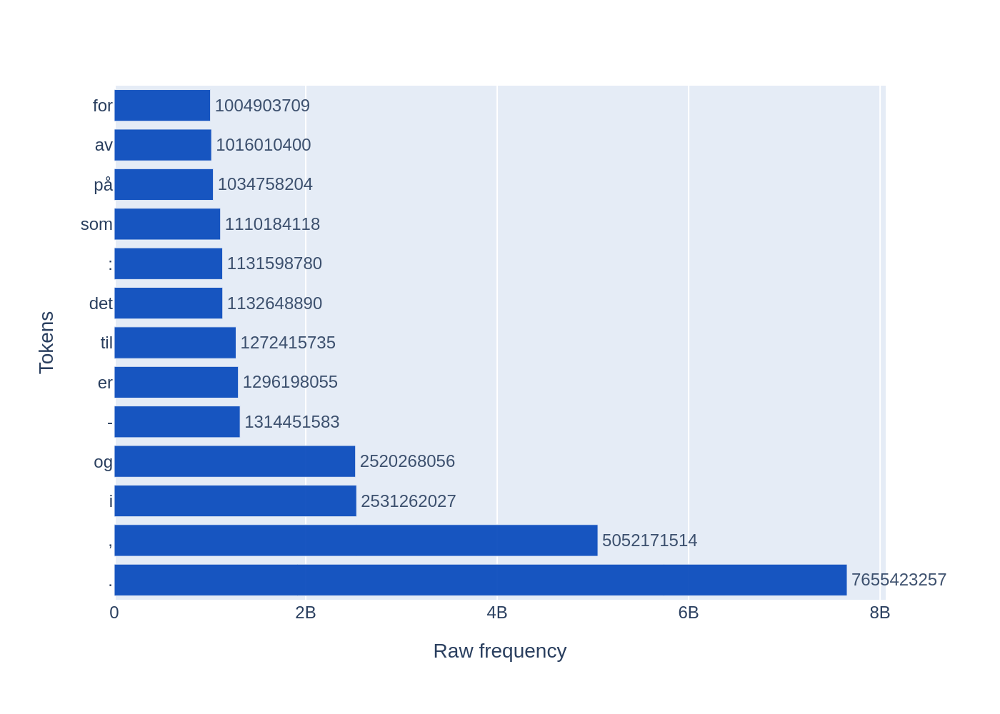
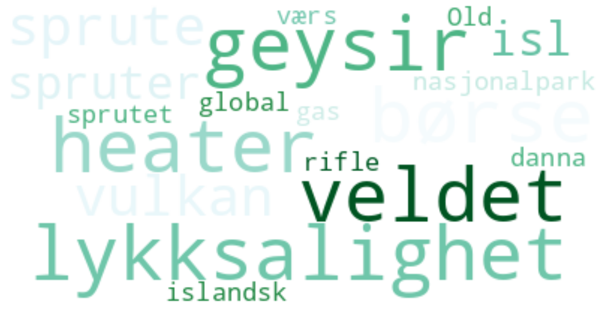
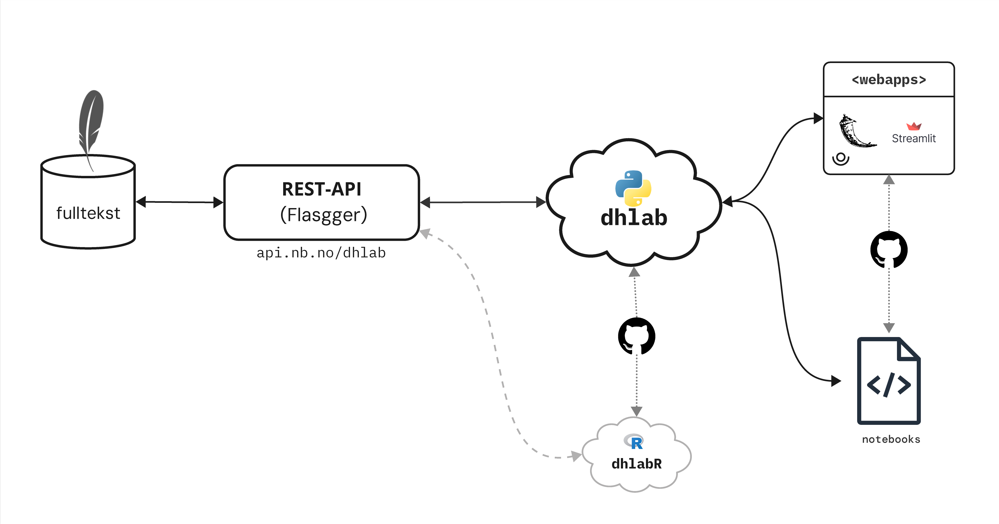
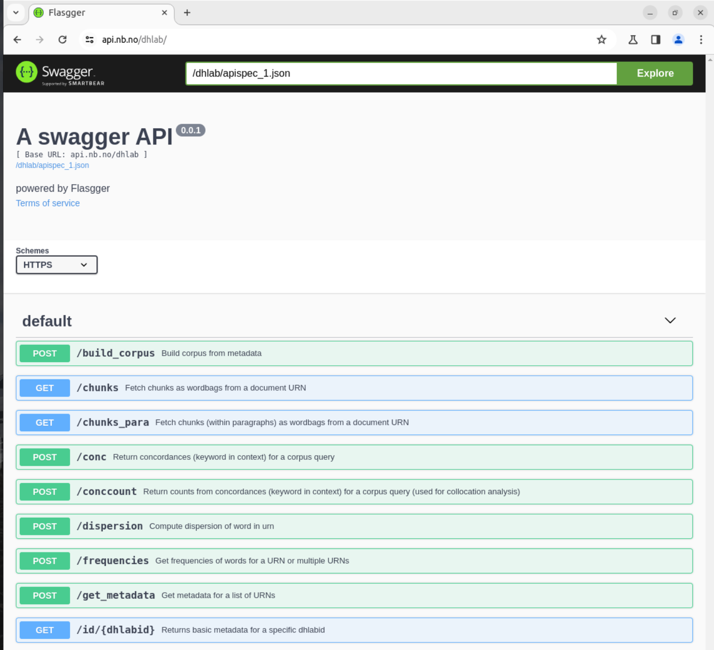
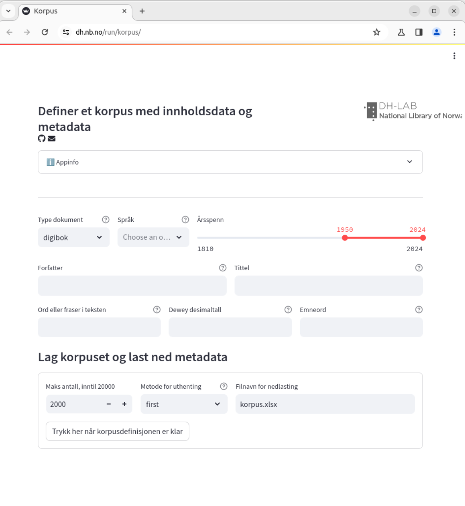
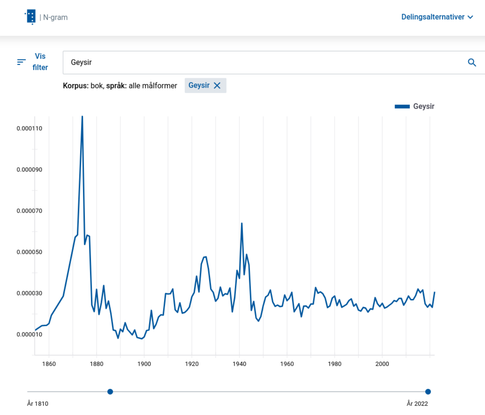
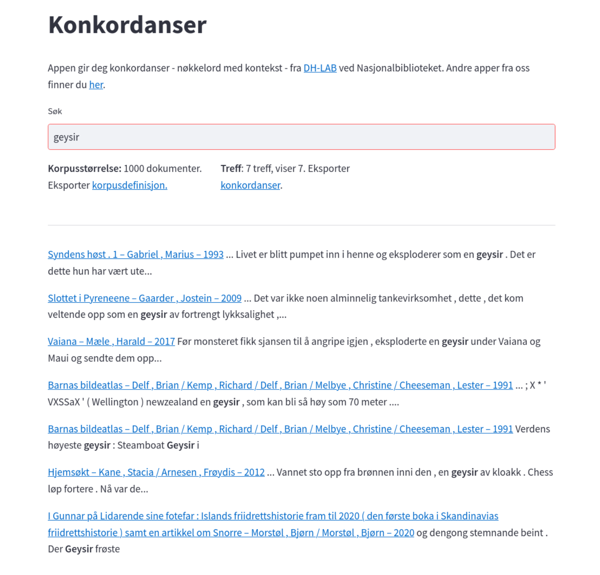

---
jupytext:
  formats: ipynb,md:myst
  notebook_metadata_filter: all,widgets,-varInspector
  text_representation:
    extension: .md
    format_name: myst
    format_version: 0.13
    jupytext_version: 1.16.2
kernelspec:
  display_name: Python 3 (ipykernel)
  language: python
  name: python3
label: slides
language_info:
  codemirror_mode:
    name: ipython
    version: 3
  file_extension: .py
  mimetype: text/x-python
  name: python
  nbconvert_exporter: python
  pygments_lexer: ipython3
  version: 3.10.12
title: presentation
---

+++ {"slideshow": {"slide_type": "slide"}}

# Navigating Digital Landscapes

**Experiences from A Decade of Engaging with users of Digital Humanities**

Lars G. Johnsen, Jana Sverdljuk, Ingerid Løyning Dale, Lars Magne Tungland, Jon Carlstedt Tønnessen ([The National Library of Norway](https://www.nb.no/dh-lab/))

_DHNB2024, Reykjavik, 29.05.2024_

<!--
Add this to the yaml notebook config:

file_format: mystnb
kernelspec:
  name: python3
-->

+++ {"slideshow": {"slide_type": "slide"}, "note": "Session 1: 45 min"}

## Ensuring data accessibility

* [FAIR Principles](#fair-principles)
* [Infrastructure and interoperability](#infrastructure-and-interoperability)
* [Text Digitization pipeline](#text-digitization-pipeline)

+++ {"slideshow": {"slide_type": "slide"}, "note": "LBJ \u2013 5 min"}

## [FAIR Principles](https://www.go-fair.org/fair-principles/)

Findable
: Metadata and data should be easy to find for both humans and computers, **indexed in a searchable resource** with **unique and persistent identifiers** and **rich metadata**.

Accessible
: (Meta)data can be retrieved by their identifier, and metadata are accessible even when the data are no longer available.

Interoperable
: (Meta)data should be easy to integrate with other data, applications, or workflows for analysis, storage and processing.

Reusable
: Data and metadata should should be well-described so that they can be replicated and/or combined in different settings.

---

[Wilkinson et al. 2016](doi:10.1038/sdata.2016.18)

+++ {"slideshow": {"slide_type": "slide"}, "note": "LBJ \u2013 10 min"}

## Infrastructure and interoperability

* Collaboration between Nordic countries on data
* Global identifiers

+++ {"slideshow": {"slide_type": "slide"}}

### Accessibility: Legal deposit and copyright laws

Copyright law
: The originator of a publication has the right to use, publish, and distribute it. ([Åndsverkslova](https://lovdata.no/dokument/LTI/lov/2018-06-15-40))

Legal deposit law
: Documents published in Norway are deposited at the National Library, for research and documentation purposes. ([Pliktavleveringslova](https://lovdata.no/dokument/NL/lov/1989-06-09-32))

The DH-lab has developed a range of tools and applications for analysing the digital documents, without infringing on copyright laws.

+++ {"slideshow": {"slide_type": "slide"}, "note": "ILD & LBJ \u2013 15 min"}

## Text digitization pipeline

<!-- Book -> Scanned image -> OCR -> Fulltext -> Tokens -> Reduced representations  (e.g. frequency lists, ngrams, concordances, collocations) -> User interfaces (API, python, apps) + datasets (e.g. for training ML models, quantitative analyses) -->



+++ {"slideshow": {"slide_type": "slide"}, "note": "ILD"}

## Optical Character Recognition

[](https://www.nb.no/items/URN:NBN:no-nb_digibok_2012041108172?searchText=Iceland&page=529)

+++ {"slideshow": {"slide_type": "slide"}, "note": "ILD"}

```{code-cell} ipython3
# Tokenisation and indexing of digital text
import nb_tokenizer as nbt

text = """PART V
ICELAND
INTRODUCTION
ICELAND ( Icelandic , Island ) is an island situated just south of the Arctic Circle , 600 miles west of Norway . It is the second largest island in Europe , the largest being Great Britain . It has an area of close on 40,000 square miles ( a third as large again as Scotland ) and a coast line of over 3,000 miles ."""

for i, t in enumerate(nbt.tokenize(text)[:10]):
    print(t)
```

+++ {"slideshow": {"slide_type": "slide"}, "note": "ILD"}

## Data aggregations

For example, total word frequencies across all our digital texts:


+++ {"slideshow": {"slide_type": "slide"}, "note": "ILD"}

Or word collocations:



+++ {"slideshow": {"slide_type": "slide"}, "note": "Session 2: 60 min, LMT", "subtitle": "Session 2"}

## Creating User-Friendly Interfaces and Applications

* [API](https://api.nb.no/dhlab/)
* [python library](https://pypi.org/project/dhlab/)
* [R library](https://github.com/NationalLibraryOfNorway/dhlabR)
* [Web apps](https://www.nb.no/dh-lab/apper/)

+++ {"slideshow": {"slide_type": "slide"}}

## User Interfaces

[](https://www.nb.no/dh-lab/)

+++ {"slideshow": {"slide_type": "slide"}}

## Application Programming Interface

[](https://api.nb.no/dhlab/)

+++ {"slideshow": {"slide_type": "slide"}}

## Python Library


<!-- LMT 15 min -->
Install the [`dhlab`](https://pypi.org/project/dhlab/) python library from pypi, for use in e.g. Jupyter Notebooks such as our [DHlab tutorial](https://nationallibraryofnorway.github.io/digital_tekstanalyse/tutorial.html):

```python3
pip install -U dhlab
```

+++ {"slideshow": {"slide_type": "slide"}}

## Apps
<!-- LBJ, LMT 15 min -->

* [Corpus builder](#corpus)
* [N-gram statistics](#n-grams)
* [Concordances](#concordances)
* [Collocations](#collocations)
* More apps in the [DH-lab app gallery](https://www.nb.no/dh-lab/apper/)

+++ {"slideshow": {"slide_type": "slide"}}

### Corpus

_Construct a collection of document IDs and their metadata with a search interface_:

[dh.nb.no/run/korpus/](https://dh.nb.no/run/korpus/)

[](https://dh.nb.no/run/korpus/)

+++ {"slideshow": {"slide_type": "slide"}}

### N-grams

_Frequency counts of uni-, bi- and trigrams over time_:

[nb.no/ngram/](https://www.nb.no/ngram/#1_1_1__1_1_3_1810%2C2022_2_2_2_12_2)

[](https://www.nb.no/ngram/#1_1_1__1_1_3_1810%2C2022_2_2_2_12_2)

+++ {"slideshow": {"slide_type": "slide"}}

### Concordances

_Immediate, word level contexts of specific search terms_:

[dh.nb.no/run/konkordans/](https://dh.nb.no/run/konkordans/)

[](https://dh.nb.no/run/konkordans/)

+++ {"slideshow": {"slide_type": "slide"}}

### Collocations

_Aggregated concordances, ranked by word similarity scores calculated with pointwise mutual information_:

[dh.nb.no/run/kollokasjon/](https://dh.nb.no/run/kollokasjon/)


<!---  --->

+++ {"slideshow": {"slide_type": "slide"}}

## Break 10:00 - 10:30

+++ {"slideshow": {"slide_type": "slide"}, "note": "Session 3: 45 min, JS", "subtitle": "Session 3"}

## Combining Quantitative and Qualitative Methods

+++ {"slideshow": {"slide_type": "slide"}}

## Hermeneutic principles

<!-- LBJ, JS 10 min -->

+++ {"slideshow": {"slide_type": "slide"}}

## Collocations and discourse analysis

<!-- JS 10 min -->

+++ {"slideshow": {"slide_type": "slide"}}

## Historiography meets Algorithms

Alsvik and Munch-Møller [2020](https://www.idunn.no/doi/10.18261/issn.1894-3195-2020-03-03)

+++ {"slideshow": {"slide_type": "slide"}}

## The Rise of Health

**A Collocation Analysis of Conceptual Changes in News Discourse, 1950–2010**

Kveim Lie, Johnsen, Jordheim, and Ytreberg [2022](https://www.berghahnjournals.com/view/journals/contributions/17/2/choc170202.xml)

+++ {"slideshow": {"slide_type": "slide"}}

## Skjønnlitteraturen: en kroppsvisitasjon

Uri and Johnsen [2021](https://barnebokinstituttet.no/aktuelt/skjonnlitteraturen-en-kroppsvisitasjon/)

+++ {"slideshow": {"slide_type": "slide"}}

## Thank you for attending

Explore more DH-lab tools and methods from our website:

<https://www.nb.no/dh-lab/>

[Bibliography](https://nationallibraryofnorway.github.io/digital_tekstanalyse/bibliography/bibliography.html)
